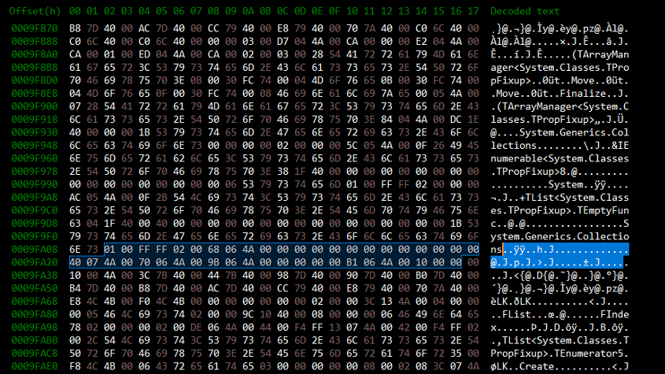

# Binary and Hexadecimal Systems

For representing information (instructions and data), computers use the binary system (base 2).
When writing programs in assembly language, the hexadecimal system (base 16) is preferred because it saves the programmer from writing long strings of 1s and 0s, and conversion to/from binary can be done much more easily than with the decimal system (base 10).

>**NOTE**: We'll use the prefix `0b` for representing numbers in binary and `0x` for hexadecimal numbers.
> For example, we can write the unsigned integer `127` as `0b01111111` or `0x7F`.

## Binary System

In the **binary system** (base 2), values are represented as a string of 0s and 1s.
Each digit in the string represents a bit, and a group of 8 bits forms a byte.
A group of 4 bits is called a **nibble** or **half-byte**.

### Operations with Values Represented in Binary

#### Arithmetic Operations

Arithmetic operations are the classic `+`, `-`, `*`, `/` (integer division), `%` (modulo).
Fundamentally they work the same way in any base 10, 2, 16 etc.
Just keep in mind what the maximum digit is for each of these bases so you know when to carry or subtract 1 to or from the higher-order digit of the result or operand.

You can find a few examples of arithmetic operations in base 2 [here](https://www.tutorialspoint.com/computer_logical_organization/binary_arithmetic.htm)

### Logical Operations

#### Operators on Binary Values

- **NOT Operation**:
Inverts each bit.

Example:

```text
INV(0b10011010) = 0b01100101
```

- **Logical AND Operation**:
Performs the 'and' operation between bits at the same positions in operands.

Example:

```text
0b1001 AND 0b0111 = 0b0001
```

- **Logical OR Operation**:
Performs the 'or' operation between bits at the same positions in operands.

Example:

```text
0b1001 OR 0b0111 = 0b1111
```

- **Exclusive OR (XOR) Operation**:

If bits at the same positions in operands have equal values, the resulting bit is 0;
otherwise, it's 1.

Example:

```text
0b1001 XOR 0b0111 = 0b1110
```

#### Logical Shifts

Logical shifts left/right involve moving each bit by one position.
Since the result must be on the same number of bits as the initial value, the first bit is lost, and the empty space is filled with a 0 bit.


For explanations related to bitwise operations in C, refer to the guide at [Bitwise Operators in C](https://www.geeksforgeeks.org/bitwise-operators-in-c-cpp/).

## Hexadecimal System

In the **hexadecimal system** (base 16), values are represented as a string of characters from '0' to '9' or 'a' to 'f'.
A byte consists of two such characters, so each character corresponds to a group of 4 bits (a nibble).

### Conversion from Decimal to Binary/Hexadecimal

- Divide the number successively by the base number (2 or 16) and keep the remainders.
- When the quotient of the division becomes 0, write down the remainders in reverse order.
- In the case of base 16, when the remainder is greater than 9, letters a-f are used (`0xa = 10`, `0xf = 15`).

#### Example: Conversion of the number 0xD9B1 to decimal

$$ \texttt{0xD9B1} = 1 \cdot 16 ^ 0 + 11 \cdot 16 ^ 1 + 9 \cdot 16 ^ 2 + 13 \cdot 16 ^ 3 = 55729 $$

### Conversion between Binary and Hexadecimal

As mentioned earlier, a digit in a hexadecimal number corresponds to a group of 4 bits (a nibble).
Therefore, to convert a number from hexadecimal to binary, it's sufficient to transform each digit into the equivalent 4-bit group.

#### Example: Conversion of the number 0xD9B1 to binary

- `0x1 = 0b0001`
- `0xB = 0b1011`
- `0x9 = 0b1001`
- `0xD = 0b1101`

Thus, the resulting binary number is `0b1101100110110001`.

The reverse operation, conversion from binary to hexadecimal, can be done by converting each group of 4 bits into the corresponding digit in hexadecimal.

### Use of Base 16 Representation

The hexadecimal system is used to represent memory addresses and to visualize data in a more interpretable way than a sequence composed only of 0s and 1s.
The image below provides an example in this regard:



(Image taken from [Digital Detective](https://www.digital-detective.net/))

## Representation of Data Types

In a computer's memory, a value is stored on a fixed number of bits.
Depending on the architecture, each processor can access a maximum number of bits in a single operation, which represents the word size.

The sizes of common data types used in C are dependent on both the processor and the platform on which the program was compiled (operating system, compiler).
The table below presents the sizes of data types on a 32-bit architecture processor, when the program is compiled using gcc under Linux.

On the left side of the image [above](#use-of-base-16-representation), we have memory addresses where data is located.
At address `0x0009FA08`, the first 4 bytes starting from offset `0x02` are `0x01` `0x00`, `0xFF`, `0xFF`.
These can represent a 4-byte integer, 4 characters, or 2 integers on 2 bytes.
By using base 16, we can interpret the data and infer what they might represent.

The table below shows the sizes of data types on a 32-bit processor.

| Data Type   | Number of Bits | Number of Bytes |
|:-----------:|:--------------:|:---------------:|
| `char`      | 8              | 1               |
| `short`     | 16             | 2               |
| `int`       | 32             | 4               |
| `size_t`    | 32             | 4               |
| `long`      | 32             | 4               |
| `long long` | 64             | 8               |

| pointer     | 32             | 4               |

On a 64-bit machine, the table above still holds true except for the types below.
On 64-bit processors, addresses are 64 bits wide, which obviously affects the size of pointers and `size_t`.

| Data Type   | Number of Bits | Number of Bytes |
|:-----------:|:--------------:|:---------------:|
| `size_t`    | 64             | 8               |
| `long`      | 64             | 8               |
| pointer     | 64             | 8               |

## Order of Representation for Numbers Larger than One Byte (Little-Endian vs Big-Endian)

For representing values larger than one byte, there are two possible methods, both used in practice:

- Little-Endian: The least significant byte is stored first (bytes are stored in reverse order).
This model is used by the Intel x86 processor family.

- Big-Endian: The most significant byte is stored first.

**Example**: We want to store the value 0x4a912480 in memory on 32 bits (4 bytes), starting at address `0x100`, using both methods:

| Method        | Address `0x100` | Address `0x101` | Address `0x102` | Address `0x103` |
|:-------------:|:---------------:|:---------------:|:---------------:|:---------------:|
| Little-Endian | 0x80            | 0x24            | 0x91            | 0x4a            |
| Big-Endian    | 0x4a            | 0x91            | 0x24            | 0x80            |
